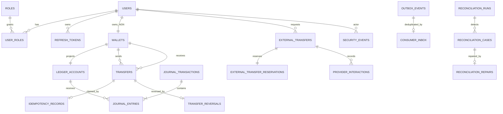

# Entity relationship overview

Ledger journal references connect financial entries to transfers and reversals without making mutable business state authoritative. Outbox aggregate IDs connect committed business changes to events; consumer inbox event IDs suppress duplicate effects.
