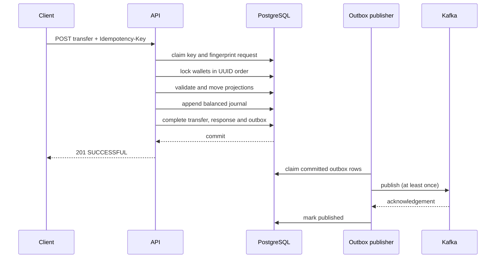

# Transfer sequences

## Internal transfer

```mermaid
sequenceDiagram
  participant C as Client
  participant A as API
  participant DB as PostgreSQL
  participant P as Outbox publisher
  participant K as Kafka
  C->>A: POST transfer + Idempotency-Key
  A->>DB: claim key and fingerprint request
  A->>DB: lock wallets in UUID order
  A->>DB: validate and move projections
  A->>DB: append balanced journal
  A->>DB: complete transfer, response and outbox
  DB-->>A: commit
  A-->>C: 201 SUCCESSFUL
  P->>DB: claim committed outbox rows
  P->>K: publish (at least once)
  K-->>P: acknowledgement
  P->>DB: mark published
```

No Kafka call occurs while wallet locks are held.
