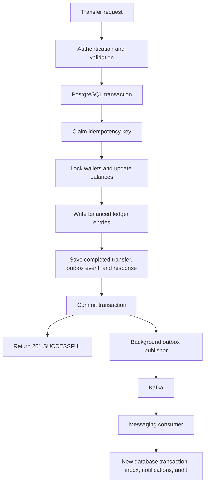

# Wallet-to-wallet transfer walkthrough

This guide follows an internal transfer through the API, PostgreSQL, ledger, outbox, Kafka, notifications, and reconciliation.

Assume both wallets are active, use NGN, and have no reserved funds:

- Your wallet starts with **₦10,000**.
- The recipient's wallet starts with **₦2,000**.
- You transfer **₦3,000**.

The process has two parts: completing the money transfer in PostgreSQL, then processing its event through Kafka.



## 1. Submit the request

```http
POST /api/v1/transfers
Authorization: Bearer <access-token>
Idempotency-Key: <unique-key>
Content-Type: application/json
```

```json
{
  "receiverWalletId": "<recipient-wallet-uuid>",
  "amount": 3000.00,
  "currency": "NGN",
  "description": "Payment"
}
```

Replace the placeholders with a valid access token, a client-generated idempotency key, and the recipient's wallet UUID.

The application validates your token and request fields. It identifies the sender from your token; you cannot supply another person's sender wallet.

When rate limiting is enabled, Redis checks whether you have exceeded the request limit. **Redis does not store or control the money movement.**

## 2. Idempotency prevents duplicate transfers

`IdempotencyService.executeTransfer()` starts a PostgreSQL transaction. It claims an `idempotency_records` row containing your user ID, endpoint, key, and a fingerprint of the transfer details.

| Situation | Result |
| --- | --- |
| New key | Continue with the transfer |
| Same key and same request after success | Return the previously saved response |
| Same key with different transfer details | Reject with `409 Conflict` |

This protects against accidentally paying twice when a client retries after a network timeout. For a retry, keep the same key and request body. Generate a new key for a new payment.

The database's unique constraint on the user, endpoint, and key coordinates concurrent requests using the same key.

## 3. Create the transfer and lock the wallets

`TransferService` creates a transfer reference such as `TRF-…`, starts the transfer, and saves its record within the transaction.

`WalletService.moveFunds()` then:

1. Finds your wallet.
2. Rejects a transfer to the same wallet.
3. Locks both wallet rows in PostgreSQL.
4. Checks currency, wallet statuses, and available funds.

The locks prevent competing transfers from spending the same balance simultaneously. Both wallets are locked in a consistent UUID order to reduce deadlocks. The locks remain held until the transaction ends.

The sender must be active; the recipient must not be closed. The current rules allow a frozen recipient to receive funds.

## 4. Change the wallet balances

The application debits your wallet and credits the recipient's wallet:

| Wallet | Before | Change | After |
| --- | ---: | ---: | ---: |
| Yours | ₦10,000 | −₦3,000 | ₦7,000 |
| Recipient's | ₦2,000 | +₦3,000 | ₦5,000 |

Both `available_balance` and `ledger_balance` change for this internal transfer. The total remains **₦12,000**.

These changes are still inside the transaction. They are not committed yet. Hibernate tracks the changed wallet entities and writes their updates as the transaction is flushed.

## 5. Record the movement in the ledger

Wallet balances show the current position. **The ledger records the financial history that explains that position.**

`LedgerService.postTransfer()` creates:

- One row in `journal_transactions`, linked to the transfer reference.
- Two rows in `journal_entries`, linked to the wallets' existing ledger accounts.

| Ledger account | Entry | Amount |
| --- | --- | ---: |
| Your wallet account | Debit | ₦3,000 |
| Recipient's wallet account | Credit | ₦3,000 |

Wallet ledger accounts are classified as liabilities: the platform owes each customer their wallet balance. The debit reduces what it owes you; the credit increases what it owes the recipient.

The application checks that the accounts are active, the currencies match, the amounts are valid, and the entries balance:

```text
Total debits = Total credits
₦3,000       = ₦3,000
```

PostgreSQL also checks journal balance and currency consistency at commit. Database triggers prevent updates or deletion of posted journal records. A reversal creates new compensating entries instead of editing the original journal.

## 6. Complete the transfer and save the outbox event

Still inside the same transaction, the application:

- Marks the transfer `SUCCESSFUL` and records its completion time.
- Saves a `TransferCompleted` event in `outbox_events` with status `PENDING`.
- Saves the successful response in the idempotency record.

The event contains the transfer ID, reference, sender and receiver wallet IDs, amount, currency, and completion time.

**The outbox is a PostgreSQL table. Nothing has been sent to Kafka at this step.** Saving the event together with the transfer ensures a committed transfer has a durable event waiting for publication.

## 7. Commit PostgreSQL and return success

These changes commit together:

| Table | Change |
| --- | --- |
| `wallets` | Both balances updated |
| `transfers` | Successful transfer recorded |
| `journal_transactions` | Journal created |
| `journal_entries` | Debit and credit recorded |
| `outbox_events` | Event saved for publication |
| `idempotency_records` | Response saved for retries |

The nested service methods participate in the outer transaction; they do not independently commit.

**`saveAndFlush()` is not a commit.** It sends pending SQL to PostgreSQL, but the transaction can still roll back. If a database or business-rule failure occurs before commit, all the changes above roll back together, including the newly claimed idempotency record.

After a successful commit, the controller returns `201 Created`, the successful transfer response, and a `Location` header pointing to the transfer's lookup URL. It does not wait for Kafka or notifications. Background event processing can start as soon as the commit is visible, potentially before the client receives the HTTP response.

## 8. Publish the outbox event to Kafka

A background job checks for publishable outbox events approximately every second by default. It:

1. Claims an event in a short database transaction and marks it `PROCESSING`.
2. Sends it to Kafka topic `wallet.transfer.events.v1`, outside that database transaction.
3. Waits for Kafka's acknowledgment.
4. Marks the outbox row `PUBLISHED` in another database transaction.

The Kafka record uses the transfer ID as its key and includes headers for the event ID, event type, version, and correlation ID when present.

If publication fails, the publisher schedules a retry with increasing delays and jitter. Exhausted retries become `DEAD` for investigation. An expired processing claim can be reclaimed after a worker crashes.

The money transfer remains successful during a Kafka outage; its event remains recorded in PostgreSQL. Kafka publication is **at least once**, so duplicate delivery is possible.

## 9. Process the event through messaging

`TransferCompletedConsumer` receives the event and calls `TransferEventProcessingService`. That service starts a new database transaction and:

1. Validates the event identity, type, version, and payload.
2. Claims its event ID in `consumed_events`, the inbox table.
3. Creates two notification records.
4. Creates a transfer-completed audit record.
5. Marks the inbox record `PROCESSED`.

Those changes commit together. The consumer then acknowledges the Kafka message.

The inbox prevents duplicate effects. For example, if the publisher sends an event but crashes before marking it published, it may send it again. The consumer recognizes the same event ID for this consumer and skips creating duplicate records.

If processing fails before the database commit, the inbox, notification, and audit changes roll back together. Failed processing is retried; exhausted consumer retries are routed to `wallet.transfer.events.v1.dlt`, the dead-letter topic, for investigation. This is separate from an outbox row becoming `DEAD` after publication failures.

## 10. Notifications and audit records

The `notifications` table receives:

- A `TRANSFER_SENT` record for the sender: “Transfer successful.”
- A `TRANSFER_RECEIVED` record for the recipient: “Transfer received.”

The `audit_records` table receives a `TRANSFER_COMPLETED` record describing the operation.

Notifications currently remain `PENDING` in the database. Email, SMS, push delivery, and a notification-list endpoint are not implemented. Creating these records does not move money again.

## 11. Reconciliation checks consistency later

Scheduled or administrator-triggered reconciliation compares wallet balances and transfer records with the ledger. It can detect balance discrepancies or a completed transfer missing its required journal.

This is a separate financial control, not a step required to complete each transfer. The ledger remains immutable; controlled wallet-projection repairs and compensating reversals have separate workflows.

## Failure examples

| Failure | What happens |
| --- | --- |
| Insufficient funds | The financial transaction rolls back; neither wallet changes |
| Ledger posting fails | Wallet updates, transfer, idempotency claim, and event roll back together |
| Client loses the response after commit | Retrying the same key and body returns the saved response |
| Kafka is unavailable | The transfer stays successful; outbox publication is retried |
| Event is delivered twice | Inbox deduplication prevents duplicate notification and audit records |
| Notification or audit persistence fails | The consumer transaction rolls back and processing is retried |

## Summary

**PostgreSQL completes and records the money movement atomically. The outbox preserves the event, Kafka carries it, and messaging creates notifications and an audit record afterward.**

For implementation details, see [internal transfers](transfers.md), [ledger design](ledger.md), [idempotency](idempotency.md), [transactional outbox](transactional-outbox.md), [event consumers](event-consumers.md), and [financial reconciliation](financial-reconciliation.md).
